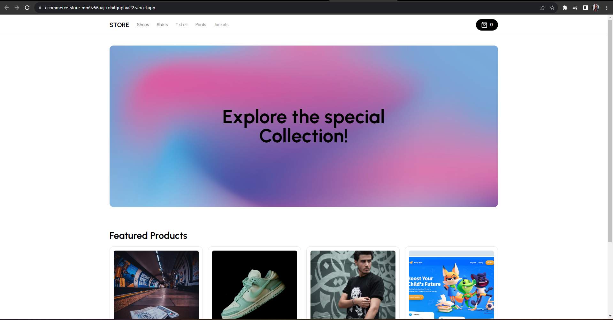

# Full Stack E-Commerce + Dashboard & CMS: Next.js 13 App Router, React, Tailwind, Prisma, MySQL, 2023




For DEMO, use [Stripe Testing Cards](https://stripe.com/docs/testing)

This is a repository for a Full Stack E-Commerce + Dashboard & CMS: Next.js 13 App Router, React, Tailwind, Prisma, MySQL

## MAKE SURE YOU HAVE [ADMIN] SETUP FIRST

Key Features:

- The admin dashboard has been designed to function as a comprehensive CMS, Admin panel, and API management system.
- I've implemented functionalities to create, update, and delete categories effortlessly.
- I've integrated the capability to manage multiple vendors or stores seamlessly through this unified CMS. For instance, you can oversee diverse stores like "Shoe Store," "Laptop Store," and "Suit Store," with the CMS automatically generating distinct API routes for each one.
- I've incorporated features that enable the creation, modification, and removal of products with ease.
- I've integrated a robust system that allows the upload of multiple images for products, facilitating image changes at any time.
- I've developed a flexible system to create, update, and delete various filters such as "Color" and "Size." These filters can then be seamlessly associated within the "Product" creation form.
- I've implemented a user-friendly interface for the creation, updating, and deletion of attention-grabbing "Billboards." These prominent text sections can be linked to specific categories or stand alone. The associated API routes are dynamically generated by our Admin.
- I've incorporated a comprehensive search functionality across categories, products, sizes, colors, and billboards, complete with pagination support.
- I've included a feature that empowers you to highlight specific products as "featured," ensuring their visibility on the homepage.
- I've designed an intuitive system for tracking and managing orders, sales, and other relevant metrics.
- I've integrated graphical representations, such as revenue graphs, to provide insightful visualizations.
- I've used Clerk for Authentication, allowing for secure and efficient user authentication.
- Other features include
- Order creation
- Stripe checkout
- Stripe webhooks
- MySQL + Prisma + PlanetScale

### Prerequisites

**Node version 14.x**

### Cloning the repository

```shell
git clone https://github.com/rohitt-gupta/ecommerce-store.git
```

### Install packages

```shell
npm i
```

### Setup .env file

```js
NEXT_PUBLIC_API_URL= https://ecom-dashboard-five.vercel.app/
```

### Start the app

```shell
npm run dev
```

## Available commands

Running commands with npm `npm run [command]`

| command         | description                              |
| :-------------- | :--------------------------------------- |
| `dev`           | Starts a development instance of the app |